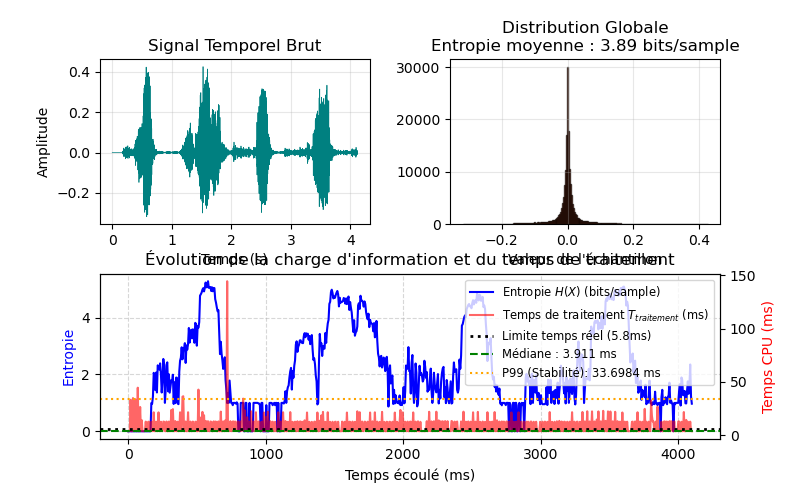
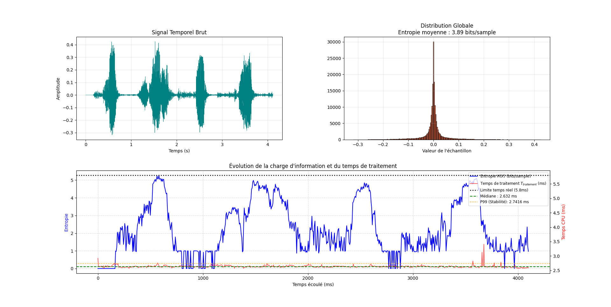
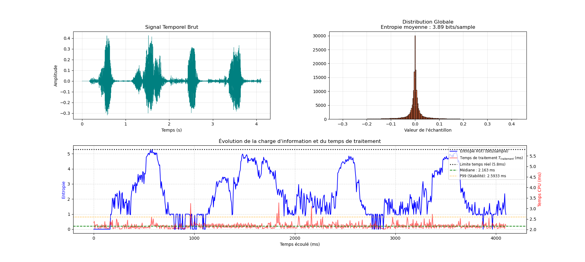

[Revenir sur la page principale](https://github.com/Aphaistos/tipe_cpge/) \
[Revenir sur la page des notes](../../notes)

# Rapport de Recherche : Algorithme de Cooley-Tukey
**Date :** 12 Mai 2026

# Introduction et Problématique

La transmission sécurisée de la voix en temps réel impose un double défi : garantir la
confidentialité des échanges tout en respectant une fluidité stricte. Selon la norme
ITU-T G.114, la latence de bout en bout ne doit pas excéder 150 ms. Cette étude
explore l'utilisation de l'algorithme de Cooley-Tukey (FFT) comme levier de réduction d'entropie, facilitant ainsi un chiffrement robuste sans compromettre la continuité
temporelle.

# Analyse Comparative des Algorithmes

L'expérience a comparé un codage statistique temporel (Huffman) à une approche
fréquentielle basée sur la FFT itérative de Cooley-Tukey.

| Métrique | Huffman (Temporel) | Cooley-Tukey (Fréquentiel) |
| ---- | ---- | ---- |
| **Entropie Moyenne** | 11,67 bits/sample | 3,89 bits/sample |
| **Complexité** | $O(N)$ | $O(N \log(N))$ |
| **Stabilité (P99)** | ~18 ms (instable) | **3,38 ms (déterministe)** |

**Observation majeure :** Le passage dans le domaine fréquentiel réduit l'entropie d'un facteur 3. Cette réduction de la redondance augmente la **distance d'unicité** du cryptosystème, rendant la cryptanalyse statistiquement plus complexe.

# Impact de l'Environnement Système (Benchmark Multi-OS)

L'algorithme a été testé sur quatre plateformes pour évaluer la gigue induite par l'ordonnanceur (scheduler) de ces dernières.

| Système d'Exploitation | Graphique | Médiane $T_{traitement}$ | Stabilité (Gigue) | Observations |
| ---- | ---- | ---- | ---- | ---- |
| **Raspberry Pi (OS)** |  | 3,911 ms | Médiocre | Pics critiques à 140ms (risques de coupures). |
| **Windows 11** |  | 2,632 ms | Moyenne | Bruit de fond constant dû aux autres processus parallèles. |
| **Kali Linux** |  | 2,163 ms | Excellente | Compromis idéal entre outils et performance. |
| **Xubuntu (XFCE)** |  | **2,004 ms** | **Optimale** | L'environnement le plus stable pour le temps réel. |

# Interprétation des Résultats pour le TIPE

## Déterminisme et Latence

Bien que plus complexe mathématiquement, l'implémentation itérative avec bit-
reversal de Cooley-Tukey se révèle plus stable que Huffman. Le temps de traitement médian reste largement sous le budget de *BLOCK_MS* (5,8 ms à 20 ms selon la fenêtre), garantissant la fluidité.

## Efficacité de la Chaîne de Sécurisation

La réduction d'entropie observée (de 11,67 à 3,89) valide l'hypothèse selon laquelle la quantification fréquentielle prépare idéalement le signal au chiffrement. En transformant le signal audio en une suite de symboles moins redondants, on s'approche de la condition de **Secret Parfait** définie par Shannon lors de l'application d'un XOR avec un flux de clé.

# Conclusion et Perspectives

L'algorithme de Cooley-Tukey est le pilier central de cette chaîne sécurisée. L'étude montre que le choix de l'OS est aussi critique que le choix de l'algorithme pour garantir la stabilité du flux. Les prochaines étapes consisteront à intégrer un chiffrement et à vérifier que l'entropie finale du message intercepté tend vers celle d'un bruit blanc (8 bits/sample pour un canal 8 bits).
