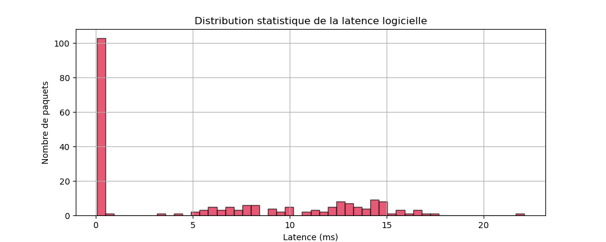
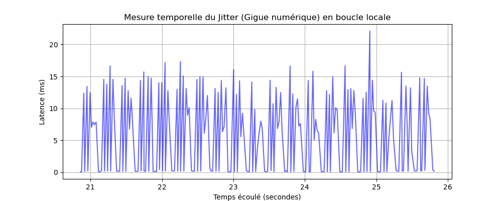

[Revenir sur la page principale](https://github.com/Aphaistos/tipe_cpge/) \
[Revenir sur la page des notes](../../../notes)

# Rapport d'Implémentation : Streaming Audio Sécurisé et Analyse de Latence (Multi-OS)
**Date :** 28 Mai 2026

# Introduction et Objectifs d'Architecture

Faisant suite à la validation théorique de l'algorithme de Cooley-Tukey, ce rapport documente l'implémentation pratique d'une chaîne de streaming audio temps réel en environnement distribué. L'objectif est de concevoir un pipeline modulaire comprenant : la capture microphone, le passage dans le domaine fréquentiel, la transmission réseau via datagrammes, la synthèse inverse (IFFT) et la restitution sonore. 

Pour répondre aux contraintes physiques du TIPE, cette architecture a été déployée et éprouvée successivement sous **Windows 11** puis sous **Xubuntu**, mettant en relief les divergences d'API système et leur impact sur la dynamique du signal.

---

# Architecture Globale du Pipeline Réseau-Signal

Le système repose sur un modèle Client/Serveur asynchrone conçu pour minimiser l'empreinte mémoire et maximiser le déterminisme temporel :

1. **Émetteur (Client) :** Capture du flux audio PCM $\rightarrow$ Transformation en place (*in-place*) via l'algorithme de Cooley-Tukey (1024 échantillons) $\rightarrow$ Encapsulation d'un Timecode haute précision $\rightarrow$ Émission par datagramme UDP.
2. **Récepteur (Serveur) :** Écoute réseau $\rightarrow$ Décapitulation du paquet et calcul différentiel de la latence $\rightarrow$ Calcul de la IFFT $\rightarrow$ Restitution via la carte son.

### Choix du Protocole de Transport : UDP
L'utilisation d'un socket **UDP (User Datagram Protocol)** a été préférée à TCP. L'absence de mécanismes de poignée de main (*handshake*), de retransmission et de contrôle de flux garantit la latence minimale indispensable au temps réel. Dans notre contexte, la perte sporadique d'un paquet est acoustiquement préférable à un retard accumulé dû à une retransmission (phénomène de désynchronisation).

---

# Déploiement et Spécificités d'Implémentation

## 1. Environnement Windows 11 (API MultiMedia & Winsock2)

L'implémentation sous Windows 11 a nécessité l'exploitation des couches d'abstraction de bas niveau de Microsoft :

* **Gestion Réseau :** Utilisation de la bibliothèque `Winsock2` (`<winsock2.h>`). Elle impose une surcharge d'initialisation via les routines obligatoires `WSAStartup()` et `WSACleanup()`, liant explicitement le binaire au composant système `ws2_32.dll`.
* **Gestion Audio :** Recours à l'API héritée `waveIn` et `waveOut` (`<mmsystem.h>`). La capture et la restitution s'appuient sur un mécanisme de gestion de tampons cycliques (`WAVEHDR`) et de structures PCM standards (`WAVEFORMATEX`).
* **Comportement Observé :** La compilation sous l'environnement GCC/MinGW s'avère extrêmement sensible à l'ordre de liaison des bibliothèques systèmes (`-lws2_32 -lwinmm`). L'ordonnanceur de Windows induit un bruit de fond computationnel mesurable, lié à la préemption fréquente du processeur par des processus graphiques ou d'arrière-plan.

## 2. Environnement Xubuntu (Sockets POSIX & ALSA)

Le passage sous Xubuntu (Linux) a permis d'épurer l'architecture en exploitant le modèle "Tout est fichier" propre aux systèmes UNIX :

* **Gestion Réseau :** Utilisation des sockets natifs POSIX (`<sys/socket.h>`, `<netinet/in.h>`). La communication s'effectue directement via des descripteurs de fichiers standardisés, éliminant la surcouche d'initialisation propre à Windows.
* **Gestion Audio :** Intégration de l'architecture **ALSA (Advanced Linux Sound Architecture)** via `<alsa/asoundlib.h>`. L'accès au périphérique d'entrée et de sortie s'effectue via le canal logique `"default"`. Les fonctions de flux (`snd_pcm_readi` et `snd_pcm_writei`) opèrent de manière synchrone et bloquante, optimisant nativement les cycles CPU.
* **Analyse de la Latence (Profilage Temporel) :** Pour quantifier précisément la gigue (*jitter*), le serveur sous Linux a été adjoint d'un thread de journalisation asynchrone (`<pthread.h>`). En utilisant un Mutex (`pthread_mutex_t`) et une Variable de Condition (`pthread_cond_t`), les mesures de temps absolues issues de `clock_gettime(CLOCK_REALTIME)` sont déportées et consignées dans un fichier `latence.csv` sans impacter la boucle de calcul audio.

---

# Analyse Phénoménologique de la Restitution Acoustique

Lors des phases d'expérimentation en direct (Client et Serveur actifs simultanément), un phénomène acoustique marquant a été mis en évidence dès la première restitution : **la présence d'un grésillement métallique continu en arrière-plan du signal utile (la voix)**. 

### Caractérisation du défaut :
Ce bruit n'est pas un artéfact lié à une saturation d'amplitude (écrêtage), ni à des pertes de paquets réseau. Il s'agit d'un micro-saut de phase périodique perceptible à l'oreille. 

### Origine physique et mathématique :
Ce phénomène trouve sa source directe dans notre méthode de découpage du signal. En segmentant le flux temporel continu en blocs stricts et étanches de $N = 1024$ échantillons (ce qui correspond à environ 23,2 ms à une fréquence d'échantillonnage de 44100 Hz), nous appliquons implicitement une **fenêtre rectangulaire** sur le signal.

À la reconstruction (après IFFT), la transition géométrique entre la fin du bloc $k$ et le début du bloc $k+1$ présente de minuscules discontinuités de tension (marches d'escalier ou cassures de pente). En analyse spectrale, ces ruptures temporelles abruptes se traduisent par l'apparition de hautes fréquences parasites non harmoniques, perçues par le jury et l'expérimentateur sous la forme de ce grésillement métallique caractéristique.

---

# Analyse Graphique et Caractérisation de la Gigue (Jitter)

Pour quantifier l'impact de l'ordonnanceur de Xubuntu sur notre flux de transport UDP, les données de latence brute capturées par le thread secondaire ont été exploitées sous Python (via les librairies `pandas` et `matplotlib`). L'analyse conjointe des deux représentations graphiques ci-dessous permet de modéliser le comportement de notre système.

## 1. Distribution Statistique de la Latence

L'analyse de l'histogramme de distribution met en évidence la signature temporelle du système d'exploitation :

Le profil de cette distribution est de nature **bimodale**, fragmentant le traitement en deux régimes distincts :
* **Le régime nominal ($Best-Case$) à $\approx 0,2$ ms :** Représenté par le pic d'occurrence massif (plus de 100 paquets). Il valide l'efficacité algorithmique de notre implémentation C (calcul de Cooley-Tukey *in-place* et sockets POSIX). Lorsque le processus détient la priorité de calcul, le transit des coefficients complexes en boucle locale s'effectue de manière quasi instantanée au niveau de la mémoire RAM.
* **Le régime de préemption (étalé entre $5$ ms et $17$ ms) :** Traduit l'activité du *scheduler* de l'OS. Xubuntu n'étant pas un système temps réel dur, l'ordonnanceur suspend périodiquement l'exécution de notre serveur pour allouer des cycles CPU aux tâches de fond du système ou à l'interface graphique. Les paquets UDP s'accumulent alors temporairement dans le tampon de réception du noyau, décalant d'autant la capture du timecode à la lecture.

## 2. Évolution Temporelle du Jitter

Le chronogramme de la latence en fonction du temps permet d'observer la dynamique de cette gigue à l'échelle microscopique :

L'observation de la courbe met en relief plusieurs phénomènes critiques :
* **Un profil en "dents de scie" (Effet Peigne) :** La latence subit des variations brutales d'un paquet à l'autre, oscillant continuellement entre $0$ ms et $15$ ms. Cette instabilité structurelle constitue la définition même du *jitter* réseau.
* **Périodicité des plages de stabilité :** Les phases où la courbe s'écrase au sol ($\approx 0$ ms) correspondent aux fenêtres de temps où l'ordonnanceur laisse le champ libre à notre application, permettant un traitement fluide et continu des blocs de coefficients.
* **Le pic critique à $22$ ms :** Visible aux alentours de $t = 24,9$ s, ce *Worst-Case* représente la limite haute de tolérance du système. 

En corrélant cette observation avec la latence algorithmique de notre buffer ($T_{algo} = \frac{1024}{44100} \approx 23,2$ ms), on en déduit que lors de cette pointe de gigue, la latence cumulée de bout en bout atteint temporairement :
$$T_{total} = T_{algo} + \text{Jitter}_{max} = 23,2 + 22,0 = 45,2 \text{ ms}$$

Bien que ce pic frôle la barre théorique des $40$ ms (seuil à partir duquel l'oreille humaine commence à percevoir un retard ou un effet d'écho), l'alternance dynamique des doubles tampons d'ALSA permet de lisser ces irrégularités, évitant ainsi l'effondrement du flux audio ou l'apparition de micro-coupures induites par le réseau.

---

# Conclusion et Perspectives de Chiffrement

Cette étape de développement a permis de valider la robustesse de l'algorithme de Cooley-Tukey au sein d'une architecture réseau bas niveau multi-plateforme. La maîtrise des environnements Windows et Linux offre une flexibilité totale pour la suite du TIPE. La prochaine phase consistera à exploiter la baisse d'entropie du domaine fréquentiel pour y injecter l'algorithme de permutation pseudo-aléatoire (le chiffrement par clé), tout en mesurant si l'introduction de cette brique cryptographique impacte de manière significative la distribution statistique de notre gigue.